# Africa - iOS

It is a practice app for leanring SwiftUI, JSON Decoder, System APIs implementation, and etc.

No cocaPods or external libraries needed.

**Concepts Learned:**

- Subview
- `@State` & `@Binding` data model
- Swift Bundle extension
- AVKit & Mapkit
- Animation
- View Modifier
- Swift Property
- `UIImpactFeedbackGenerator()`

## Screenshots

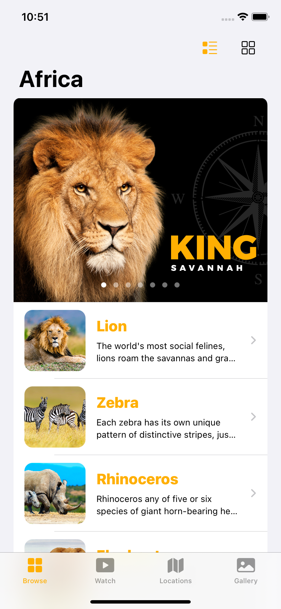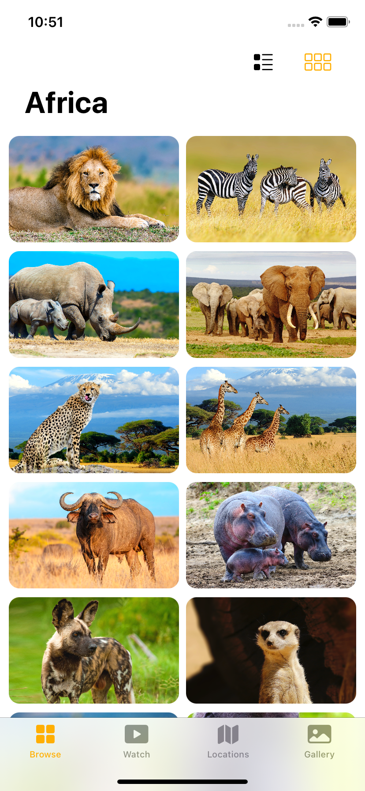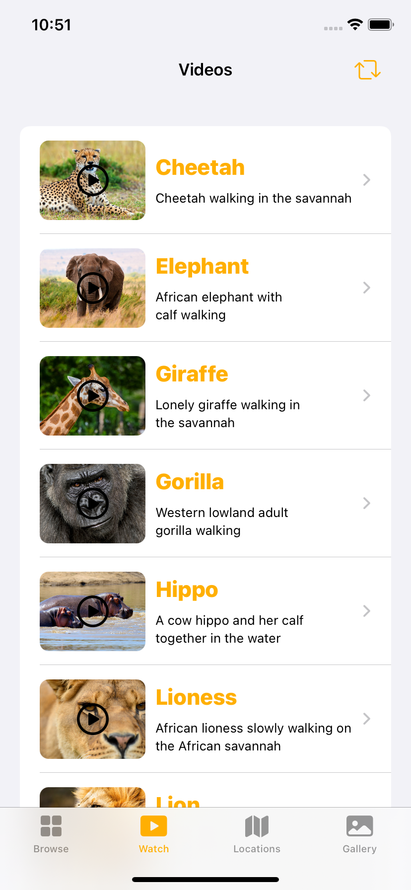

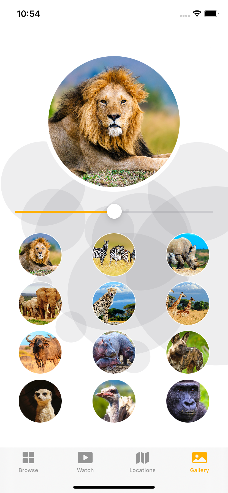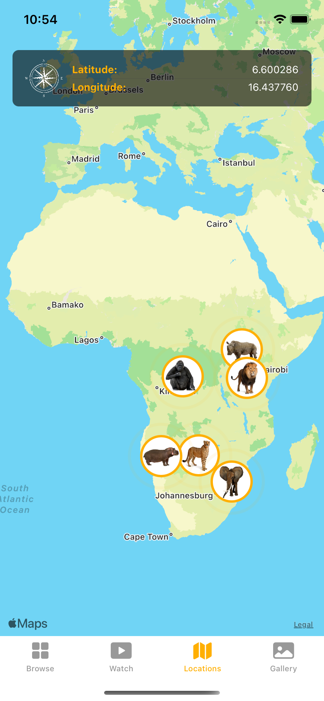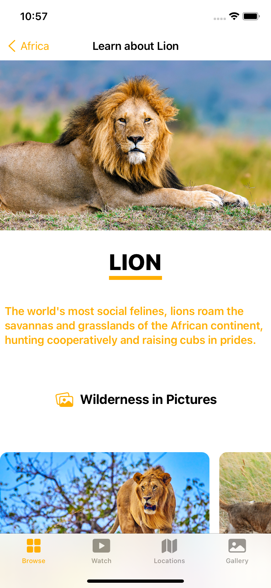

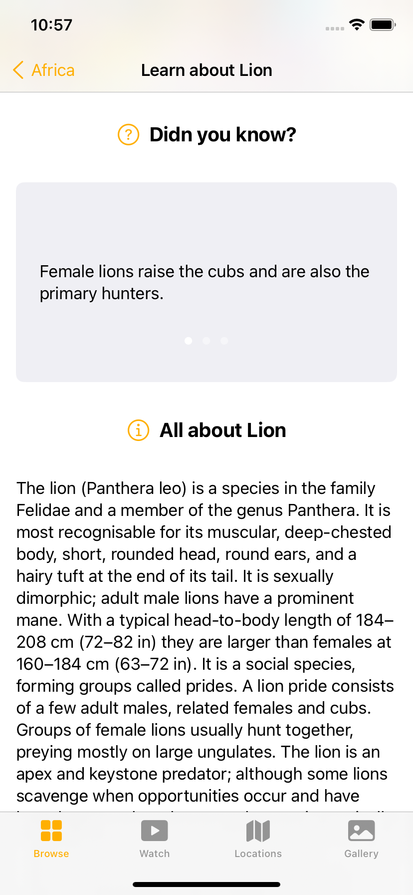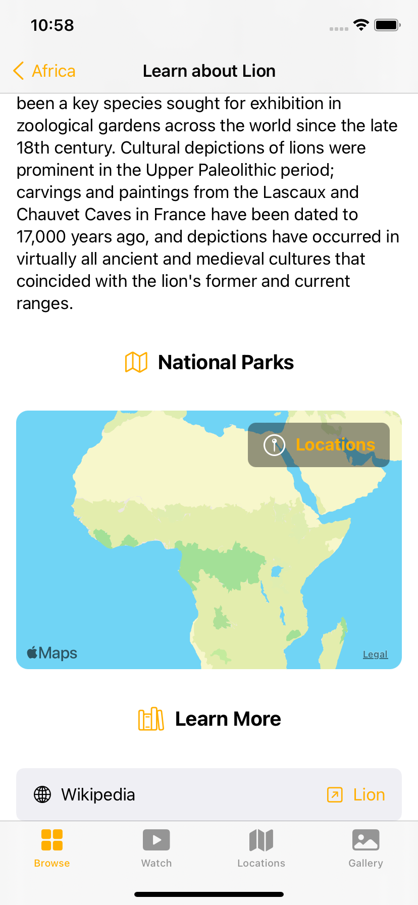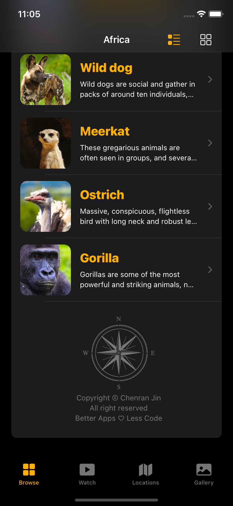

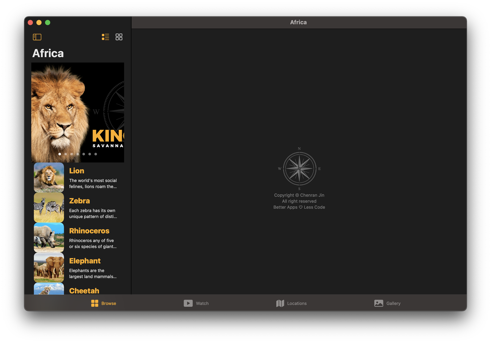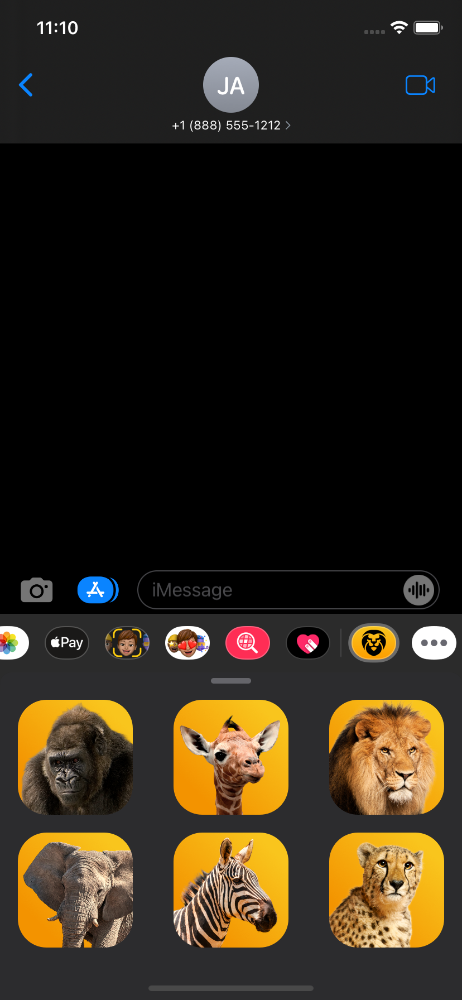

